# Red Team Security & Code Quality Report

## `scripts/aggregate-recipe-nutrients.ts`

**Version:** 3.0 (Full Dependency Analysis)  
**Date:** 2026-02-02  
**Analyst:** Red Team  
**Scope:** Full code path including all dependencies

---

## Executive Summary

| Severity | Count | Status |
|----------|-------|--------|
| 🔴 Critical | 1 | NEW |
| 🟠 High | 2 | NEW |
| 🟡 Medium | 4 | 2 existing, 2 NEW |
| 🟢 Low | 6 | 4 existing, 2 NEW |

**Overall Assessment:** Script is functional but has **one critical issue** (potential data corruption on partial failures) and **two high-severity issues** (memory and connection management). Most issues stem from missing validation and edge case handling.

---

## Dependencies Analyzed

| Dependency | Version | Risk |
|------------|---------|------|
| `pg` | ^8.18.0 | ✅ Standard |
| `dotenv` | ^17.2.3 | ✅ Standard |
| `tsconfig.json` | ES2017 | ⚠️ See TS2802 |

### Database Tables Touched

| Table | Operation | FK Constraints |
|-------|-----------|----------------|
| `canonical_ingredient` | SELECT | — |
| `canonical_fdc_membership` | SELECT | FK → foods(fdc_id) CASCADE |
| `food_nutrients` | SELECT | FK → foods(fdc_id) CASCADE |
| `nutrients` | SELECT | — |
| `canonical_ingredient_nutrients` | INSERT/UPDATE/DELETE | FK → canonical_ingredient CASCADE, FK → nutrients |

---

## 🔴 CRITICAL Issues

### Issue 1: Race Condition in `--force` Mode Can Corrupt Data

**Location:** Lines 216-278

**Description:** In `--force` mode, the script:
1. BEGINs a transaction
2. DELETEs all existing nutrient rows for the ingredient
3. INSERTs new rows in batches
4. COMMITs

If the script crashes or is killed between step 2 and step 4, **the ingredient loses ALL nutrient data** with no recovery mechanism.

**Current Code:**
```typescript
await client.query("BEGIN");

if (forceMode) {
  await client.query(
    `DELETE FROM canonical_ingredient_nutrients WHERE canonical_id = $1`,
    [ci.canonicalId]
  );
}

// ... batched inserts ...

await client.query("COMMIT");
```

**Impact:** 
- Partial run = complete data loss for that ingredient
- No idempotency guarantee despite ON CONFLICT
- Production data corruption risk

**Fix:**
```typescript
// Option A: Use single transaction with UPSERT only (no DELETE)
// The ON CONFLICT already handles updates, DELETE is redundant

// Option B: If DELETE is required, do it atomically:
await client.query(`
  WITH deleted AS (
    DELETE FROM canonical_ingredient_nutrients 
    WHERE canonical_id = $1
    RETURNING *
  )
  INSERT INTO canonical_ingredient_nutrients (...) 
  VALUES ... 
  ON CONFLICT DO UPDATE ...
`);

// Option C: Use TRUNCATE in transaction (fastest for full rebuild)
```

**Recommendation:** Remove DELETE entirely. The `ON CONFLICT DO UPDATE` already handles overwrites. DELETE is only useful if nutrient IDs can be removed, which doesn't happen in normal operation.

---

## 🟠 HIGH Severity Issues

### Issue 2: Unbounded Memory Growth for Large Ingredients

**Location:** Lines 172-199

**Description:** The script loads ALL nutrient data for an ingredient into memory:
```typescript
const nutrientData = await client.query<{...}>(
  `SELECT fn.nutrient_id, n.unit_name, fn.amount
   FROM food_nutrients fn
   JOIN canonical_fdc_membership cfm ON cfm.fdc_id = fn.fdc_id
   JOIN nutrients n ON n.nutrient_id = fn.nutrient_id
   WHERE cfm.canonical_id = $1
   ORDER BY fn.nutrient_id, fn.amount`,
  [ci.canonicalId]
);
```

For an ingredient with 100+ member foods × ~150 nutrients = **15,000+ rows loaded at once**.

**Impact:**
- Memory pressure for large canonical ingredients
- Potential OOM on constrained environments
- No streaming/cursors used

**Calculation:**
- 15,000 rows × ~100 bytes/row = 1.5MB per ingredient
- 800 ingredients processed = 1.2GB peak if not GC'd

**Fix:** Use a cursor or streaming:
```typescript
const cursor = client.query(new Cursor(sql, params));
let rows;
while ((rows = await cursor.read(1000)).length > 0) {
  // process in chunks
}
```

---

### Issue 3: Pool Not Properly Cleaned on Script Interruption

**Location:** Lines 24-31, 350-353

**Description:** The script creates its own `Pool` but only calls `pool.end()` in the `finally` block:
```typescript
function getPool(): Pool {
  return new Pool({ connectionString, max: 5 });
}

// ... later in finally:
await pool.end();
```

If the process is killed (SIGINT, SIGTERM), `pool.end()` may not be called, leaving connections hanging.

**Impact:**
- Connection leaks in Supabase pooler
- Potential "too many connections" errors on repeated runs
- pgbouncer may hold stale connections

**Fix:** Add signal handlers:
```typescript
const cleanup = async () => {
  await pool.end();
  process.exit(0);
};

process.on("SIGINT", cleanup);
process.on("SIGTERM", cleanup);
```

---

## 🟡 MEDIUM Severity Issues

### Issue 4: No Validation of `--slug` Argument

**Location:** Lines 103-107

**Description:** The `--slug` argument is passed directly to SQL (parameterized, so no injection), but there's no validation:
```typescript
const slugIdx = process.argv.indexOf("--slug");
const slugFilter = slugIdx !== -1 ? process.argv[slugIdx + 1] : undefined;
```

**Problems:**
- `--slug` without a value → `slugFilter = undefined` (OK, but confusing)
- `--slug --force` → `slugFilter = "--force"` (clearly wrong)
- No slug format validation (should be lowercase kebab-case)

**Fix:**
```typescript
if (slugIdx !== -1) {
  const nextArg = process.argv[slugIdx + 1];
  if (!nextArg || nextArg.startsWith("--")) {
    console.error("Error: --slug requires a value");
    process.exit(1);
  }
  if (!/^[a-z0-9-]+$/.test(nextArg)) {
    console.error("Error: slug must be lowercase kebab-case");
    process.exit(1);
  }
  slugFilter = nextArg;
}
```

---

### Issue 5: `Number()` Coercion Without NaN Check

**Location:** Lines 193-195

**Description:**
```typescript
const nid = Number(row.nutrient_id);
const amt = Number(row.amount);
```

If the DB returns unexpected data (e.g., null, empty string), `Number()` returns `NaN` which propagates silently.

**Impact:**
- `NaN` in sorted arrays breaks percentile calculations
- `NaN` written to DB may fail constraint or corrupt data

**Fix:**
```typescript
const nid = Number(row.nutrient_id);
const amt = Number(row.amount);

if (Number.isNaN(nid) || Number.isNaN(amt)) {
  console.warn(`Skipping invalid row: nutrient_id=${row.nutrient_id}, amount=${row.amount}`);
  continue;
}
```

---

### Issue 6: `nTotal` vs `nSamples` Semantics Can Cause Division Issues

**Location:** Lines 86-89, 206

**Description:** 
- `nTotal` = total member foods (from `member_count`)
- `nSamples` = foods with this specific nutrient

If a nutrient is only present in 2 of 50 foods, `nSamples=2` but `nTotal=50`. This is semantically correct but potentially misleading for consumers expecting `nTotal` to mean "total samples used".

**Not a bug, but add documentation:**
```typescript
// nSamples: count of foods that have this nutrient (used for stats)
// nTotal: total member foods in canonical (context, not used in computation)
```

---

### Issue 7: Missing Index for Nutrient Query Performance

**Location:** Lines 172-183

**Description:** The query joins `food_nutrients` → `canonical_fdc_membership` but relies on:
- `idx_membership_fdc_id` on `canonical_fdc_membership(fdc_id)`
- Primary key on `food_nutrients(fdc_id, nutrient_id)`

The query filters by `canonical_id` but joins on `fdc_id`. For large membership sets, this may not be optimal.

**Verify with EXPLAIN ANALYZE:**
```sql
EXPLAIN ANALYZE
SELECT fn.nutrient_id, n.unit_name, fn.amount
FROM food_nutrients fn
JOIN canonical_fdc_membership cfm ON cfm.fdc_id = fn.fdc_id
JOIN nutrients n ON n.nutrient_id = fn.nutrient_id
WHERE cfm.canonical_id = 'some-uuid';
```

**Potential Fix:** Add covering index if performance is poor:
```sql
CREATE INDEX idx_membership_canonical_fdc 
  ON canonical_fdc_membership (canonical_id, fdc_id);
```

---

## 🟢 LOW Severity Issues

### Issue 8: Unused `paramIndex` Increment

**Location:** Line 121

```typescript
conditions.push(`ci.canonical_slug = $${paramIndex}`);
values.push(slugFilter);
paramIndex++;  // never used again
```

**Fix:** Remove or comment for future extensibility.

---

### Issue 9: Progress Output Every 50 Items Not Configurable

**Location:** Line 286

Hardcoded `50`. For large runs or debugging, this should be configurable.

---

### Issue 10: No Dry-Run Mode

There's no `--dry-run` flag to preview what would be processed without writing.

**Fix:** Add `--dry-run` that skips the INSERT/UPSERT but runs all queries.

---

### Issue 11: Date Object Created Per Batch Row

**Location:** Line 250

```typescript
vals.push(
  // ... 12 other values ...
  new Date()  // Created for EVERY row in batch
);
```

For 500-row batches, this creates 500 identical Date objects.

**Fix:**
```typescript
const now = new Date();
for (const s of batch) {
  vals.push(..., now);
}
```

---

### Issue 12: Pool `max: 5` When Script Uses Single Client

**Location:** Line 30

```typescript
return new Pool({ connectionString, max: 5 });
```

Script only uses one connection (`pool.connect()` once). `max: 5` wastes resources.

**Fix:** `max: 1` for single-threaded scripts.

---

### Issue 13: Missing SSL Configuration

**Location:** Line 30

Script's pool doesn't configure SSL:
```typescript
return new Pool({ connectionString, max: 5 });
```

Compare to `src/lib/db.ts`:
```typescript
ssl: { rejectUnauthorized: false },
```

**Impact:** May fail on some hosted Postgres instances requiring SSL.

**Fix:** Match `db.ts` SSL config or parse from connection string.

---

## Data Integrity Checks

### Foreign Key Analysis

| Constraint | Risk |
|------------|------|
| `canonical_ingredient_nutrients.canonical_id` → `canonical_ingredient` | ✅ CASCADE DELETE protects |
| `canonical_ingredient_nutrients.nutrient_id` → `nutrients` | ⚠️ No CASCADE - if nutrient deleted, FK violation |
| `canonical_fdc_membership.fdc_id` → `foods` | ✅ CASCADE DELETE protects |

**Recommendation:** Add `ON DELETE CASCADE` to nutrient FK if nutrients can be removed.

---

## Concurrency Analysis

| Scenario | Risk |
|----------|------|
| Two scripts running simultaneously | 🟠 **Deadlock possible** - both may try to UPSERT same canonical_id |
| Script + API reads | ✅ Safe - PostgreSQL MVCC handles |
| Script interrupted mid-batch | 🔴 **Data corruption** (see Critical Issue 1) |

**Recommendation:** Add advisory lock:
```typescript
await client.query("SELECT pg_advisory_lock(hashtext('aggregate-nutrients'))");
try {
  // ... processing ...
} finally {
  await client.query("SELECT pg_advisory_unlock(hashtext('aggregate-nutrients'))");
}
```

---

## Recommendations Summary

### Priority 1 (Fix Immediately)
1. 🔴 Remove DELETE in force mode, rely on ON CONFLICT
2. 🟠 Add signal handlers for clean shutdown
3. 🟠 Add streaming/cursor for large ingredient nutrient fetches

### Priority 2 (Fix Soon)
4. 🟡 Validate `--slug` argument format
5. 🟡 Add NaN checks for Number() coercions
6. 🟡 Document nTotal vs nSamples semantics
7. 🟡 Verify query performance with EXPLAIN ANALYZE

### Priority 3 (Technical Debt)
8. 🟢 Remove unused paramIndex increment
9. 🟢 Add --dry-run mode
10. 🟢 Add SSL config to match db.ts
11. 🟢 Add advisory lock for concurrency safety

---

## What's Done Well ✅

1. **Parameterized queries** - No SQL injection risk
2. **Per-ingredient transaction** - Failures isolated
3. **Batched inserts** - Respects PostgreSQL parameter limits
4. **UPSERT pattern** - ON CONFLICT handles re-runs
5. **Percentile in JS** - Avoids pooler aggregate issues
6. **Progress indicator** - ANSI escape for clean output
7. **Verification query** - Post-run sanity check
8. **Failed count tracking** - Errors don't abort entire run
9. **Sample output** - Human-readable verification
10. **CLI ergonomics** - `--force`, `--slug` flags well-designed

---

## Test Cases to Add

```typescript
describe("aggregate-recipe-nutrients", () => {
  it("handles ingredient with 0 member foods", () => { /* should skip */ });
  it("handles ingredient with 1 member food", () => { /* p10/p90 should be null */ });
  it("handles ingredient with 2 member foods", () => { /* p10/p90 should be null */ });
  it("handles nutrient with NaN amount", () => { /* should skip or error */ });
  it("handles --slug without value", () => { /* should error */ });
  it("handles --slug with non-existent slug", () => { /* should process 0 */ });
  it("survives SIGINT mid-processing", () => { /* should rollback cleanly */ });
  it("is idempotent", () => { /* running twice produces same result */ });
});
```

---

## Appendix: Full Dependency Tree

```mermaid
flowchart TD
    ROOT["aggregate-recipe-nutrients.ts"]
    PG["pg (Pool)"]
    LIBPQ["libpq (native binding)"]
    DOTENV["dotenv"]
    ENVFILE[".env.local"]
    DB["Database Tables"]
    CI["canonical_ingredient\nmigration 009"]
    CFM["canonical_fdc_membership\nmigration 009\nFK → foods (001)"]
    FN["food_nutrients\nmigration 001\nFK → nutrients (001)"]
    N["nutrients\nmigration 001"]
    CIN["canonical_ingredient_nutrients\nmigration 011\nFK → canonical_ingredient (009)\nFK → nutrients (001)"]

    ROOT --> PG
    PG --> LIBPQ
    ROOT --> DOTENV
    DOTENV --> ENVFILE
    ROOT --> DB
    DB --> CI
    DB --> CFM
    DB --> FN
    DB --> N
    DB --> CIN
```


