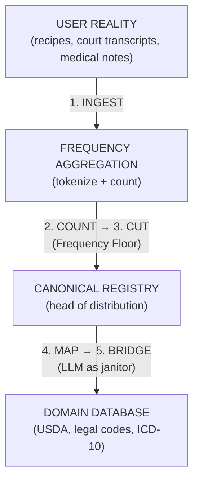

# Empirical Ontology for High-Stakes Domains: A Pattern Language

**Version:** 1.0  
**Date:** February 2026  
**See also:** [Recipe-First Architecture](/blog/recipe-first-architecture) (implementation case study)

---

## 0. Preface: The Failure That Prompted This

> *The following is a hypothetical scenario that illustrates the class of failures this architecture prevents.*

During an internal audit of an AI-assisted nutrition platform, engineers discovered that the LLM-based ingredient canonicalization system had mapped "groundnut" to "tree nut" in 847 recipes.

For a user with a peanut allergy relying on that API, this was not a data quality issue—it was a potential safety incident.

When the team attempted to debug the error, they hit a wall. Why did the model make that decision? Was it the temperature setting? A drift in the embedding model? A quirk of the training data? They could not explain *why* the mapping occurred, and more importantly, they could not guarantee it wouldn't happen again next week.

They realized that in high-stakes domains, "probability" is a euphemism for "unmanaged risk." This document describes the architecture built to replace it.

---

## Abstract

The current industry consensus treats Large Language Models (LLMs) as the universal solvent for data normalization and ontology problems. This assumption fails in high-stakes domains—such as nutrition, medicine, law, and avionics—where hallucination constitutes liability, and non-determinism prevents auditability.

This paper proposes an alternative architectural pattern: **Empirical Ontology**. Instead of using probabilistic models to infer semantic meaning, we use frequency analysis of large-scale usage data to derive canonical forms. We argue that in safety-critical systems, "what users do" (frequency) is a more reliable source of truth than "what the model thinks" (semantics).

---

## 1. The Auditability Imperative

In a low-stakes domain (e.g., generating a Spotify playlist), the cost of a false positive is an annoyance. In a high-stakes domain (e.g., calculating allergen loads or flagging legal precedents), the cost of a false positive is catastrophic.

High-stakes systems require **Radical Auditability**. When a system makes a decision—mapping Input A to Canonical Entity B—an engineer must be able to answer "Why?" with a citation, not a probability distribution.

### The Black Box Problem

When an LLM maps "groundnut" to "almond" (an actual hallucination risk), the "why" is buried in a high-dimensional vector space that is opaque to the operator. You cannot fix the error; you can only prompt-engineer around it and hope the weights don't drift.

### The Empirical Solution

In an **Empirical Ontology**, "groundnut" maps to "peanut" because 14,000 distinct records in the corpus support that association. The "why" is a SQL query:

```sql
SELECT count(*) FROM usage_logs 
WHERE term = 'groundnut' AND context = 'peanut_butter';
```

**Principle:** If you cannot trace a mapping back to a deterministic source count, it does not belong in a high-stakes production environment.

---

## 2. Descriptive vs. Prescriptive Reality

Engineers often confuse **Prescriptive Truth** (what experts say *should* exist) with **Descriptive Reality** (what actually exists).

| Type | Source | Example |
|------|--------|---------|
| **Prescriptive** | USDA FDC database | "Beef, ground, 80% lean meat / 20% fat, raw" |
| **Descriptive** | Human recipe authors | "hamburger meat", "mince", "ground beef" |

The "Semantic Trap" is the belief that an LLM can bridge this gap by *understanding* the chemistry. It cannot. It simply guesses based on training correlations.

### The Zipfian Truth

In any large corpus of user behavior, vocabulary follows a Zipfian distribution. The "head" (top 1,000 terms) represents ~86% of usage. The "tail" represents edge cases, typos, and errors.

| Zone | Terms | % of Usage | Strategy |
|------|-------|------------|----------|
| **Head** | Top 500 | ~77% | Auto-canonicalize |
| **Torso** | 500–5,000 | ~21% | Review + fuzzy match |
| **Tail** | 5,000+ | ~2% | Flag for manual review or discard |

**Pattern:** Do not use an LLM to guess the ontology. Use the "head" of the distribution to **reveal** the ontology.

---

## 3. Safe Failure Modes: Null > Wrong

In safety-critical engineering, a system must fail into a safe state.

| System Type | Behavior on Uncertainty | Risk |
|-------------|-------------------------|------|
| **LLMs** | Eager to please; provides *an* answer | Silent Failure (wrong answers presented confidently) |
| **Deterministic** | Returns `NULL` if term not found | Explicit Failure (visible, actionable) |

### The Frequency Floor Pattern

We establish a "Frequency Floor" (e.g., count ≥ 25):

```sql
-- Terms below the floor are treated as nonexistent/unsafe
SELECT * FROM recipe_ingredient_vocab
WHERE count >= 25;  -- The Frequency Floor
```

| Term | Count | Treatment |
|------|-------|-----------|
| `salt` | 85,266 | Canonical |
| `ground beef` | 5,820 | Canonical |
| `truffle oil` | 35 | Canonical (niche but real) |
| `groud beef` | 2 | Discarded (typo) |
| `unicorn tears` | 1 | Discarded (noise) |

**Result:** The system effectively "garbage collects" bad data not through intelligence, but through statistical insignificance.

---

## 4. Temporal Stability and Inference Debt

Software systems must persist over time. A critical, under-discussed risk of LLM-based ontologies is **Model Drift**.

### The Drift Problem

OpenAI updates `gpt-4` to `gpt-4-turbo`. Suddenly, the embedding distance between "sea salt" and "kosher salt" changes from 0.05 to 0.12. Your clustering algorithm now splits them into two categories instead of one.

Your entire database schema just fractured because a vendor changed a weight matrix.

### The Stability Solution

**Frequency is stable.** "Salt" will not suddenly stop being the most common ingredient in cooking. "Murder" will not stop being a primary category in criminal law.

Usage patterns shift slowly with culture—"oat milk" rose from rare to common over a decade, giving you time to adapt. Embedding distances can fracture overnight with a vendor update.

By grounding ontology in usage counts, you build on a foundation that becomes *more* stable as you add data, not less.

### Inference Debt

**Inference Debt** is the ongoing cost of re-evaluating prompts and thresholds every time a model updates. It compounds silently until a production incident exposes it.

| Approach | Debt Profile |
|----------|--------------|
| **LLM-based** | Accumulates with every model update |
| **Frequency-based** | Amortizes with every data addition |

---

## 5. The Frequency-First Architecture

We propose a standard architecture for high-stakes ontology mapping:



### The Five Steps

1. **Ingest:** Collect the raw "User Reality" (recipes, court transcripts, medical notes).
2. **Count:** Tokenize and aggregate frequency.
3. **Cut:** Apply a Frequency Floor to discard the long tail of noise.
4. **Map:** Create the "Canonical Registry" from the head of the distribution.
5. **Bridge:** Use embeddings/LLMs *only* to suggest mappings for the "Torso" (middle frequency terms) to the Canonical Head. These suggestions must be reviewed or require high confidence scores.

> **The Golden Rule:** The LLM is a janitor, not the architect. It cleans up the mess in the middle, but it does not define the building.

---

## 6. Case Study: Recipe Alchemy

**Problem:** Mapping 231,000 recipes to the USDA FoodData Central (FDC) database.

**Naive Approach:** Embedding 8,158 FDC descriptions and clustering via LLM.

**Result:** High cost (~$30/run), non-deterministic outputs ("Salt" vs "Table Salt"), and inability to distinguish granular types (80% vs 90% lean beef).

### Implementation: The Recipe-First Pattern

1. Aggregated ingredient strings from 231,637 recipes
2. Identified that the top 500 ingredients cover 85% of all usage
3. Mapped "ground beef" (freq: 5,820) directly to FDC IDs via SQL string matching

### Comparison

| Metric | LLM Approach | Empirical Approach |
|--------|--------------|-------------------|
| **Cost** | High (recurring) | Near zero (after ingest) |
| **Consistency** | Varies by temperature/model | 100% deterministic |
| **Ground Truth** | "The model feels like..." | "5,820 users wrote..." |
| **Liability** | Opaque | Defensible |
| **Debugging** | Prompt archaeology | SQL query |

For the full implementation details, see [Recipe-First Architecture](/blog/recipe-first-architecture).

---

## 7. Applicability Beyond Nutrition

This pattern applies to any domain where:

1. **User-generated data exists** at scale (documents, transactions, logs)
2. **Canonical forms are needed** for downstream processing
3. **Errors have consequences** beyond user annoyance
4. **Auditability is required** for compliance or safety

| Domain | User Reality | Prescriptive Database | Canonical Mapping |
|--------|--------------|----------------------|-------------------|
| **Nutrition** | Recipe ingredients | USDA FDC | "ground beef" → FDC IDs |
| **Legal** | Court filings, contracts | Statutory codes | "DUI" → relevant statutes |
| **Medical** | Clinical notes | ICD-10, SNOMED | "heart attack" → I21.9 |
| **Finance** | Transaction memos | Merchant categories | "AMZN" → Amazon.com |

The architecture is domain-agnostic. The principle is universal: **count before you infer**.

---

## 8. Conclusion

The "Semantic Understanding" capability of LLMs is a miracle of modern computer science, but it is a trap for ontology generation. It offers a shortcut that bypasses the hard work of understanding the domain, replacing distinct user behaviors with fuzzy vector approximations.

For high-stakes domains, we must return to the discipline of **Metrology**—the science of measurement. We must measure what exists before we try to infer what it means.

**The output of a high-stakes system must be a fact, not a guess.**

---

## References

- Zipf, G. K. (1949). *Human Behavior and the Principle of Least Effort*. Addison-Wesley.
- USDA FoodData Central: https://fdc.nal.usda.gov/
- Implementation case study: [Recipe-First Architecture](/blog/recipe-first-architecture)
