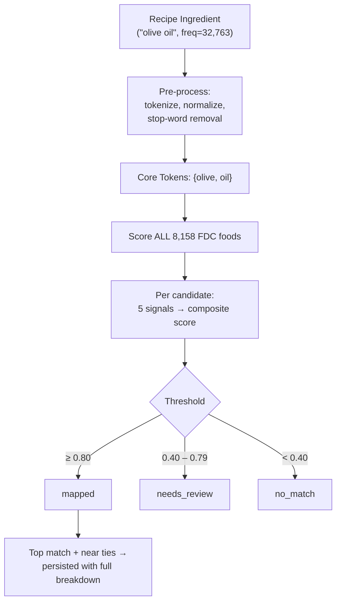

# RFC: Lexical Entity-Mapping for Safety-Critical Ingredient Matching

**Version:** 1.0
**Date:** February 2026
**Status:** Implemented
**See also:** [Empirical Ontology Pattern](empirical-ontology-pattern.md), [Recipe-First Architecture](recipe-first-architecture.md)

---

## Abstract

This document specifies a deterministic, auditable scoring algorithm for matching recipe ingredient names to USDA FoodData Central (FDC) food descriptions in a safety-critical nutrition API.

The core invariant: **"oil" must never match "boiled."** This is not a string similarity problem. It is a word boundary problem, and the solution is architectural: tokenizer-driven boundary correctness enforced via set membership, not regex.

No machine learning. No human-in-the-loop. Fully deterministic and auditable.

---

## 1. The Problem

### 1.1 Substring Matching Has No Word Boundaries

The 3-character string `oil` appears inside `boiled`, `broiled`, `foiled`, `coiled`, `toiled`, and `soiled`. A `.includes("oil")` check cannot distinguish the ingredient "oil" from the cooking method "boiled." This is a fundamental architectural flaw, not a tuning problem.

Similarly, naive first-match heuristics cannot distinguish "butter" (the dairy product) from "Cookies, butter, commercially prepared" (a baked good that contains butter). The USDA comma-separated naming convention means the ingredient name often appears as a secondary or tertiary segment, not the primary one.

### 1.2 Design Requirements

1. **Deterministic**: same inputs + same config = same outputs. No stochastic components.
2. **Auditable**: every match produces a score breakdown with reason codes. An engineer can answer "why did ingredient X map to food Y?" with citations, not probabilities.
3. **Boundary-safe**: word boundaries enforced at the tokenizer level, not via inner-loop regex.
4. **Category-aware**: "butter" should prefer Dairy over Baked Products, and this preference must be explicit and versioned.
5. **Safe publishing**: stage, validate, promote. No blind truncation of production data.

---

## 2. Architecture

The system scores every recipe ingredient against every FDC food description. With ~2,000 ingredients and ~8,158 FDC foods, this is ~16 million scoring operations --- trivially parallelizable and completable in under 10 seconds.



### 2.1 The Tokenizer Invariant

Word boundary safety comes from the tokenizer, not from regex against raw strings. Both ingredient and FDC descriptions are tokenized by the same function $\tau$:

$$\tau(\text{"boiled"}) = \{\text{boiled}\}$$

$$\tau(\text{"olive oil"}) = \{\text{olive}, \text{oil}\}$$

Token overlap is computed via **set membership on pre-tokenized sets**. The token `oil` cannot match the description "boiled potatoes" because $\text{oil} \notin \tau(\text{"boiled potatoes"})$.

This is the system's most important invariant. Every other signal operates on tokenized data. There is no path through the scoring pipeline where raw substring matching can introduce a false positive.

### 2.2 Two-Channel Tokens

Tokens are classified into two channels by a deterministic classifier $\sigma$:

- **Core tokens** ($T_I$, $T_C$): identity tokens --- the words that define *what* a food is. Examples: `chicken`, `breast`, `olive`, `oil`.
- **State tokens** ($S_I$, $S_C$): cooking, preservation, and processing state. Examples: `raw`, `cooked`, `boiled`, `frozen`, `sliced`.

State tokens are **retained as a separate channel**, not deleted. Core tokens drive all five scoring signals. State tokens are stored for potential future disambiguation but do not currently contribute to the composite score.

---

## 3. Scoring Algorithm

For each ingredient $I$ and candidate food $C$, five signals are computed and combined into a composite score.

| Signal | Weight | What It Measures |
|--------|--------|-----------------|
| Token overlap | 0.35 | IDF-weighted fraction of ingredient tokens found in candidate |
| Jaro-Winkler | 0.25 | Character-level similarity (gated by token evidence) |
| Segment match | 0.20 | Alignment with USDA primary vs. secondary comma segments |
| Category affinity | 0.10 | Whether FDC category matches a versioned expectation lexicon |
| Synonym confirmation | 0.10 | Whether known synonym tokens all appear in candidate |

### 3.1 IDF-Weighted Token Overlap

Token weights use inverse document frequency to ensure that rare, discriminative tokens (like `olive`) contribute more than common tokens (like `added`):

$$w(t) = \frac{1}{\log(2 + df(t))}$$

where $df(t)$ is the number of FDC foods containing token $t$. This is precomputed once at startup from the full corpus.

The total ingredient weight is:

$$W_I = \sum_{t \in T_I} w(t)$$

The directional overlap from ingredient to candidate is:

$$\text{Overlap}(I, C) = \frac{\sum_{t \in T_I} m(t, T_C)}{W_I}$$

where the match function $m$ handles plural/singular variants with a penalty:

$$m(t, T_C) = \begin{cases} w(t) & \text{if } t \in T_C \\ 0.9 \cdot w(t) & \text{if } t \notin T_C \text{ but } \text{plural}(t) \cap T_C \neq \emptyset \\ 0 & \text{otherwise} \end{cases}$$

Range: $[0, 1]$. The direction is intentional: we measure what fraction of the *ingredient's* tokens are found in the candidate, not the reverse. A candidate with many extra tokens (like "Oil, olive, salad or cooking") is not penalized for having tokens the ingredient doesn't mention. The 0.9 penalty ensures exact-form matches are preferred over morphological variants.

### 3.2 Jaro-Winkler Similarity (Gated)

Jaro-Winkler character-level similarity is computed against multiple candidate representations, taking the maximum:

$$JW_{\max} = \max\big(JW(I, \text{inverted}),\ JW(I, \text{plainWords}),\ JW(I, s_1),\ JW(I, p_1), \ldots, JW(I, p_k)\big)$$

where `inverted` is the human-readable form (e.g., "olive oil" from "Oil, olive"), `plainWords` is the space-joined tokens, $s_1$ is the second comma segment (when present), and $p_1 \ldots p_k$ are any parenthetical alternate names (e.g., "cilantro" from "Coriander (cilantro) leaves").

**Gating rule** --- Jaro-Winkler is gated by token evidence to prevent character-level similarity from rescuing candidates with no token overlap:

$$JW_{\text{gated}} = \begin{cases} JW_{\max} & \text{if } \text{Overlap}(I,C) \geq 0.40 \\ \min(JW_{\max},\; 0.20) & \text{if } \text{Overlap}(I,C) < 0.40 \end{cases}$$

Without this gate, Jaro-Winkler would assign high scores to strings that happen to share many characters but represent completely different foods. The gate ensures that JW only amplifies matches that already have meaningful token evidence.

### 3.3 Segment Match

USDA FDC descriptions use a comma-separated structure where the first segment is typically the primary identity. For example, in "Butter, salted", the primary segment is "Butter"; in "Cookies, butter, commercially prepared", the primary segment is "Cookies."

We compute overlap with the primary segment ($s_0$) and the remaining segments ($s_{1+}$) separately:

$$o_0 = \frac{\sum_{t \in T_I} m(t, T_{C,0})}{W_I} \qquad o_{\geq 1} = \frac{\sum_{t \in T_I \cap \bigcup_{j \geq 1} T_{C,j}} w(t)}{W_I}$$

The primary segment overlap uses the same plural-variant match function $m$ (with 0.9 penalty) as the main overlap signal. The secondary segment overlap uses exact matching only.

The segment score uses threshold buckets:

$$\text{Seg}(I,C) = \begin{cases} 1.0 & \text{if } o_0 \geq 0.60 \\ 0.6 & \text{if } o_0 < 0.60 \text{ and } o_{\geq 1} \geq 0.60 \\ 0.3 & \text{if } o_0 \geq 0.30 \text{ or } o_{\geq 1} \geq 0.30 \\ 0.0 & \text{otherwise} \end{cases}$$

This ensures "Butter, salted" (primary = "butter") beats "Cookies, butter" (primary = "cookies") when the ingredient is "butter."

### 3.4 Category Affinity

A small, explicit, versioned lexicon maps ingredient tokens to expected FDC categories:

```
"oil"     --> ["Fats and Oils"]
"butter"  --> ["Dairy and Egg Products", "Fats and Oils"]
"sugar"   --> ["Sweets"]
"flour"   --> ["Cereal Grains and Pasta"]
"salt"    --> ["Spices and Herbs"]
"chicken" --> ["Poultry Products"]
```

The affinity score checks all ingredient tokens and takes any match:

$$\text{Aff}(I,C) = \begin{cases} 1.0 & \text{if any token's expected categories include } \text{cat}(C) \\ 0.0 & \text{otherwise (neutral, not a penalty)} \end{cases}$$

When no expectation exists for any token, the score is 0 --- neutral, not a penalty. The lexicon is versioned and deterministic; it does not learn or drift.

### 3.5 Synonym Confirmation (Gated)

A synonym table maps recipe ingredient names to sets of FDC description tokens that confirm a match:

```
"olive oil"     --> {oil, olive}
"kosher salt"   --> {salt, table}
"cilantro"      --> {coriander, leaves}
"baking soda"   --> {leavening, baking, soda}
```

Satisfaction requires all tokens in the synonym set to appear in the candidate:

$$\text{sat}(\Sigma, C) = \begin{cases} 1 & \text{if } \Sigma \subseteq T_C \\ 0 & \text{otherwise} \end{cases}$$

$$\text{Syn}(I,C) = \begin{cases} \max_i \text{sat}(\Sigma_i, C) & \text{if } \text{Overlap}(I,C) > 0 \\ 0 & \text{otherwise} \end{cases}$$

The overlap gate prevents synonym confirmation from independently establishing a match --- it can only strengthen an existing one.

### 3.6 Composite Score

$$\text{Score}(I,C) = 0.35 \cdot \text{Overlap} + 0.25 \cdot JW_{\text{gated}} + 0.20 \cdot \text{Seg} + 0.10 \cdot \text{Aff} + 0.10 \cdot \text{Syn}$$

Range: $[0, 1]$.

### 3.7 Confidence Thresholds

| Score | Status | Action |
|-------|--------|--------|
| $\geq 0.80$ | `mapped` | Auto-accept. Collect all candidates within 0.05 of best. |
| $0.40 - 0.79$ | `needs_review` | Flag for manual inspection. Store best candidate. |
| $< 0.40$ | `no_match` | No credible match. |

---

## 4. Worked Example

### "olive oil" vs. "Oil, olive, salad or cooking"

Pre-processing (using uniform IDF weights $w(t) = 1.0$ for clarity):

- $T_I = \{\text{olive}, \text{oil}\}$, $W_I = 2.0$
- $T_C = \{\text{oil}, \text{olive}, \text{salad}, \text{cooking}\}$
- Inverted name: "olive oil" (resolved from container category "Oil" + second segment "olive")
- Segments: $s_0 = \text{"oil"}$, $s_1 = \text{"olive"}$, $s_2 = \text{"salad or cooking"}$

Signal computation:

| Signal | Value | Weighted |
|--------|-------|----------|
| Overlap | $1.0$ (both tokens match exactly) | $0.35 \times 1.0 = 0.350$ |
| JW | $1.0$ ("olive oil" vs. inverted name "olive oil" --- identical) | $0.25 \times 1.0 = 0.250$ |
| Segment | $0.3$ ($o_0 = 0.5$: "oil" in primary; $o_{\geq 1} = 0.5$: "olive" in secondary; neither $\geq 0.60$, both $\geq 0.30$) | $0.20 \times 0.3 = 0.060$ |
| Affinity | $1.0$ ("oil" expects "Fats and Oils") | $0.10 \times 1.0 = 0.100$ |
| Synonym | $1.0$ ($\{\text{oil}, \text{olive}\} \subseteq T_C$) | $0.10 \times 1.0 = 0.100$ |
| **Composite** | | **0.860** $\to$ `mapped` |

With real IDF weights (where "olive" is rarer than "oil" and thus $w(\text{olive}) > w(\text{oil})$), the segment score increases because the secondary segment overlap $o_{\geq 1}$ exceeds 0.60, yielding a composite $\approx 0.91$.

### vs. "Olives, green, raw"

- $T_C = \{\text{olives}, \text{green}\}$
- Overlap: "olive" matches "olives" via plural variant ($0.9 \times w$), "oil" not found. Overlap $= 0.9 / 2.0 = 0.45$.
- JW: gated (overlap $\geq 0.40$), but "olive oil" vs. "olives green" is low.
- Affinity: "olive" has no entry in `CATEGORY_EXPECTATIONS`, "oil" expects "Fats and Oils" which does not match "Vegetables and Vegetable Products". Score $= 0$.
- Composite $\approx 0.42$ $\to$ `needs_review`

The system correctly identifies "Oil, olive, salad or cooking" as the intended match, not raw olives.

---

## 5. USDA Inverted Naming

FDC uses an inverted naming convention: "Oil, olive" instead of "olive oil." The system resolves this at load time using domain knowledge sets exported from the canonicalization layer:

- **Container categories** (oil, spices, nuts, seeds, sauce, ...): "Oil, olive" --> "olive oil"
- **Protein bases** (chicken, beef, pork, ...): "Chicken, breast" --> "chicken breast"
- **Product forms** (flour, juice, oil, powder, ...): "Wheat, flour" --> "wheat flour"
- **Poultry classifiers** (broilers or fryers, roasting, ...): skipped to find actual cut

The inverted name is one scoring input for Jaro-Winkler. It does not replace token-level matching. Raw description tokens always participate independently.

---

## 6. Tripwire Tests

The following invariants are enforced as regression tests. Any violation blocks promotion of a scoring run.

### Word Boundary Tripwires

| Input | Must NOT Match | Reason |
|-------|---------------|--------|
| "oil" | "boiled", "broiled", "foil", "toil", "coil" | Substring of cooking method |
| "salt" | "asphalt", "basalt", "cobalt" | Substring of mineral/material |
| "corn" | "corner", "cornucopia" | Prefix of unrelated word |
| "ham" | "champignon" | Substring of mushroom name |

### Medical Correctness Tripwires

| Ingredient | Must Map To | Must NOT Map To |
|-----------|------------|----------------|
| "oil" | Fats and Oils category | Boiled/broiled foods |
| "butter" | Butter, salted (Dairy) | Cookies, butter (Baked) |
| "sugar" | Sugar, turbinado (Sweets) | Cookies, sugar (Baked) |
| "olive oil" | Oil, olive (Fats and Oils) | Olives, raw (Vegetables) |
| "olive" | Olives, ripe (Vegetables) | Oil, olive (Fats and Oils) |

---

## 7. Run-Based Staging

Scoring results are not written directly to production tables. Instead, each scoring run produces a versioned artifact:

1. **Stage**: results are written to a staging table keyed by `run_id`, with full config, tokenizer hash, and IDF hash recorded.
2. **Validate**: tripwire tests and distribution sanity checks run against the staged data.
3. **Promote**: a single-row pointer table (`lexical_mapping_current`) is updated to point at the new `run_id`.

**Rollback is instant**: repoint the current pointer to the previous `run_id`. No data is deleted; all runs are retained for audit.

---

## 8. Performance

| Metric | Value |
|--------|-------|
| FDC corpus size | 8,158 foods (SR Legacy + Foundation) |
| Recipe ingredients | ~2,000 (frequency $\geq$ 25) |
| Total scoring pairs | ~16.3 million |
| Scoring throughput | ~5ms per ingredient (all 8K candidates) |
| Full run | ~10 seconds |
| Startup (load + IDF build) | ~200ms |
| Memory | ~50MB |

The scorer is pure functions with no I/O in the hot path. All FDC food data is pre-processed once at startup into in-memory structures with $O(1)$ token set membership.

---

## 9. What This Architecture Does Not Do

- **No AI inference.** Scoring is deterministic arithmetic on pre-tokenized sets.
- **No embedding similarity.** There are no vectors, no cosine similarity, no semantic search.
- **No human-in-the-loop.** The `needs_review` tier flags candidates for optional inspection but does not require it for the system to function.
- **No learning or drift.** The category expectation lexicon and synonym table are versioned in source control. They change only through explicit code review.

In a domain where a 25x error in fat content could affect medical decisions, "the model thinks these are similar" is not an acceptable justification. Every match in this system can be explained by citing the exact token overlap, segment position, category match, and synonym confirmation that produced the score.
